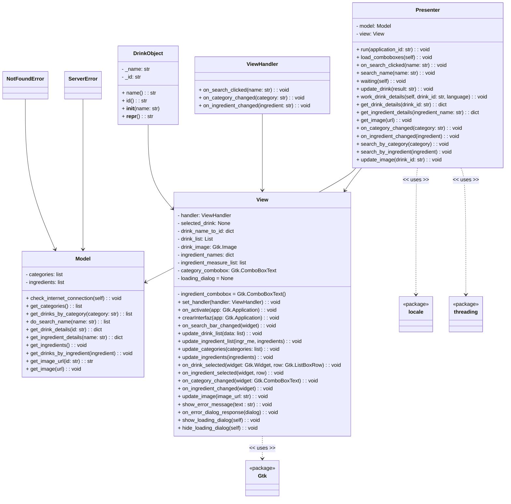
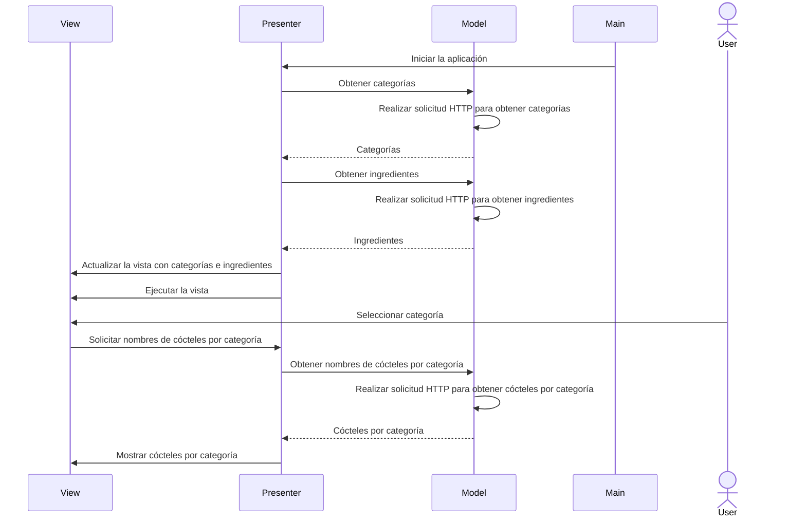
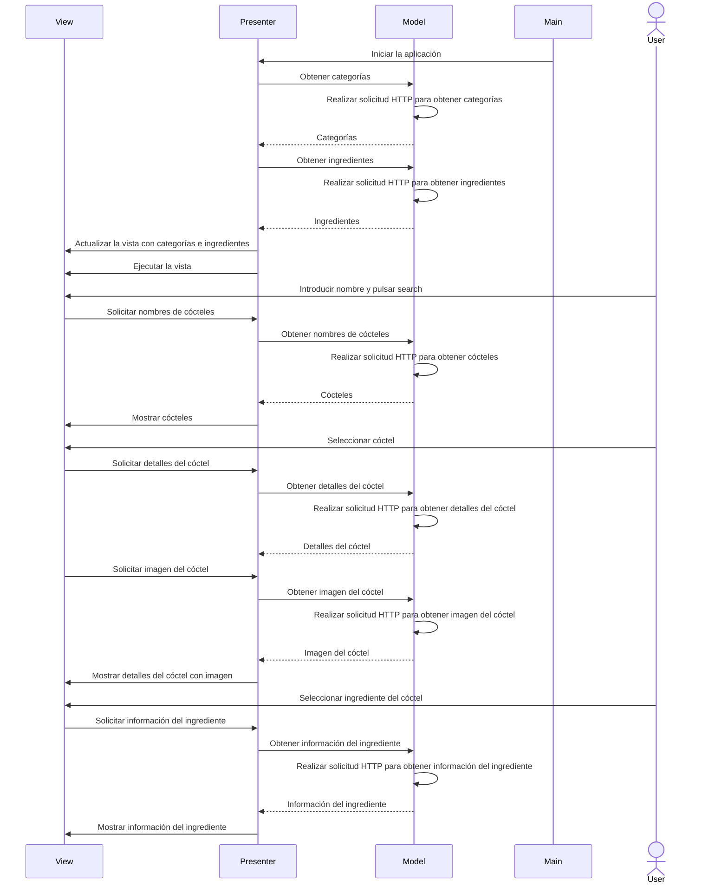
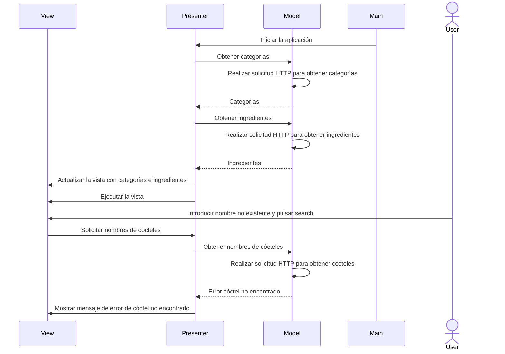
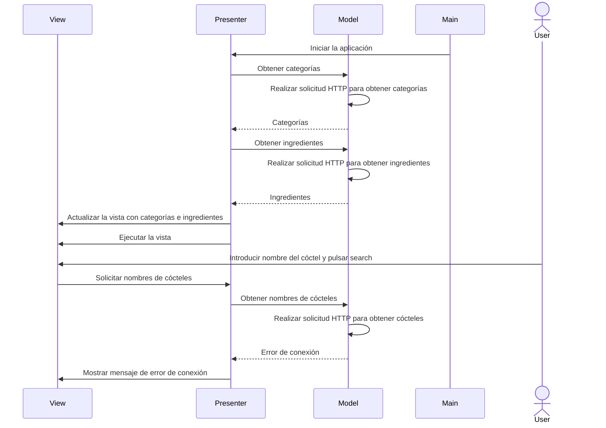
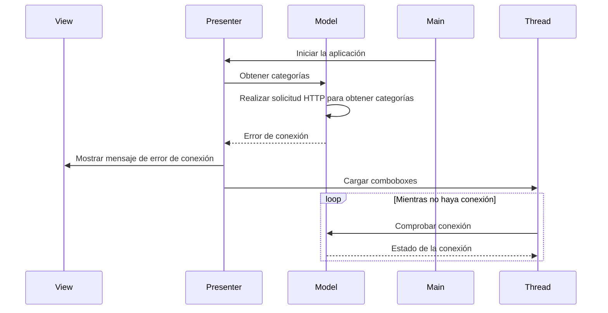
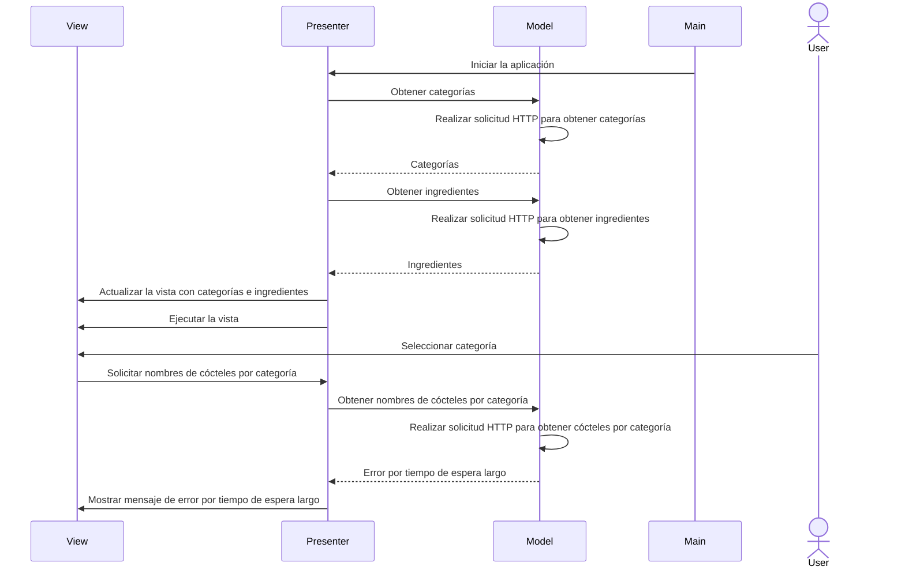
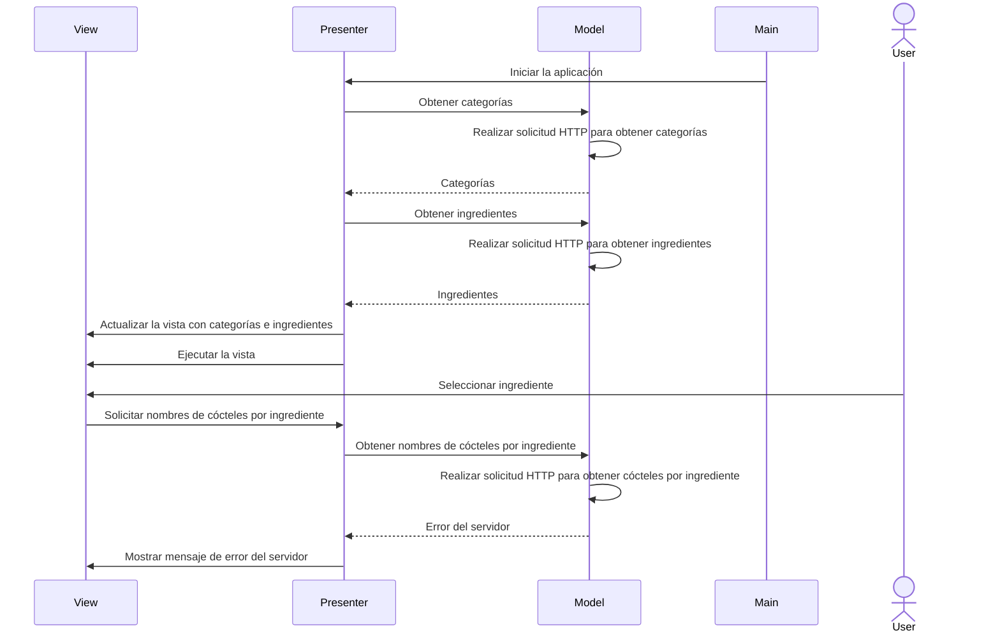

# Diseño software

>!-- ## Notas para el desarrollo de este documento
>En este fichero debeis documentar el diseño software de la práctica.

 >:warning: El diseño en un elemento "vivo". No olvideis actualizarlo
 >a medida que cambia durante la realización de la práctica.

 >:warning: Recordad que el diseño debe separar _vista_ y
 >_estado/modelo_.
	 

>El lenguaje de modelado es UML y debeis usar Mermaid para incluir los
diagramas dentro de este documento. Por ejemplo:

>Diagrama de secuencia que contiene los casos de uso de listar categorías, listar ingredientes y buscar cócteles por categoría

>Diagrama de secuencia que contiene los casos de uso de listar categorías, listar ingredientes y buscar cócteles por ingrediente

>Diagrama de secuencia que contiene los casos de uso de listar categorías, listar ingredientes,
>buscar por nombre, obtener imagen, mostrar detalles del cóctel y mostrar información del ingrediente

>Diagrama de secuencia que muestra una situación en la que se mostraría el error de no enconntrado

>Diagrama de secuencia que muestra una situación en la que se mostraría el error de conexión

>Diagrama de secuencia que muestra como se gestionaría el error de conexión si sucede al iniciar la aplicación

>Diagrama de secuencia que muestra una situación en la que se mostraría el error por tiempo de espera largo

>Diagrama de secuencia que muestra una situación en la que se mostraría el error del servidor

